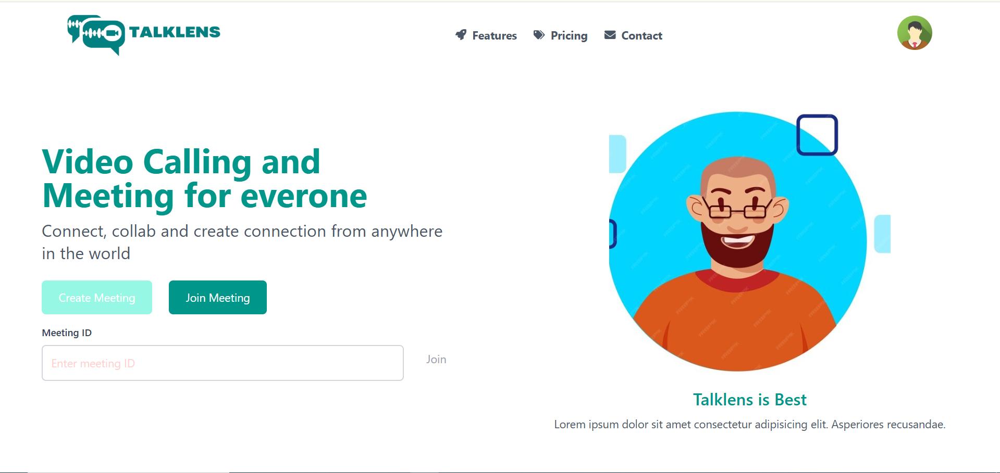
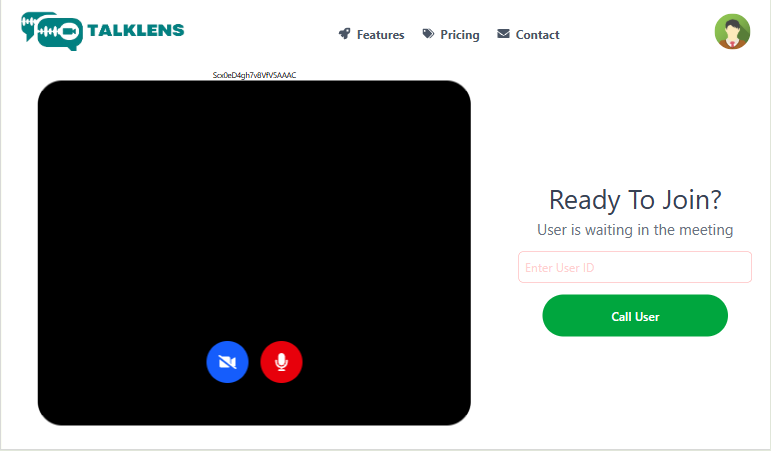

# TalkLens - Real-Time Video Calling App

**TalkLens** is a browser-based real-time video calling app built with **WebRTC** and **Socket.io**, designed to provide a seamless peer-to-peer communication experience. It enables users to initiate and participate in video calls directly from their browser without any additional installations or plugins.

## Features

- **Real-Time Video Communication**: Use WebRTC to establish peer-to-peer video calls with high performance and minimal latency.
- **Cross-Browser Compatibility**: Works on all modern browsers, including Chrome, Firefox, Safari, and Edge.
- **Secure Connections**: Video calls are encrypted for secure communication using WebRTC’s built-in security protocols.
- **No Installations**: Simply visit the app’s URL to start a video call – no downloads required.
- **User-friendly Interface**: Easy-to-use interface that allows users to start calls instantly.

## Tech Stack

### Frontend:
- **HTML5**, **CSS3**, **JavaScript**
- **React.js** for building dynamic UI
- **TailwindCSS** for styling

### Backend:
- **Node.js** with **Express.js** for building the server-side application
- **Socket.io** for handling real-time communication
- **WebRTC** for peer-to-peer communication

### Database:
- MongoDB (Real-time connections handled with Socket.io)

## Setup and Installation

### Prerequisites
- **Node.js** installed on your machine.
- **npm** (Node Package Manager) for handling packages.

### Steps to Run Locally
1. Clone the repository:
   ```bash
   git clone https://github.com/yourusername/talklens.git

2. Navigate to the project folder:
   ```bash
   cd talklens

3. Install dependencies:
   ```bash
   npm install

4. Start the development server:
   ```bash
   npm run dev

5. Open your browser and go to **http://localhost:3000** to use the app.

## How It Works

1. **Create a Room**:  
   The host creates a room where others can join by sending a unique room code.

2. **Join a Call**:  
   Users can join the video call by entering the room code shared by the host.

3. **Real-Time Communication**:  
   WebRTC establishes a peer-to-peer connection for video streaming, while Socket.io handles signaling and communication between users.

## Screenshots

1. **Home Page / Create a Room**  
   

2. **Join Room**  
   

## Contributing

We welcome contributions to TalkLens! Here’s how you can help:

1. Fork the repo and create a new branch.
2. Make your changes or improvements.
3. Open a pull request describing your changes.

## Contact

**Developer**: Prashant Chauhan  
**Email**: prashantchauhanwork@gmail.com  
**GitHub**: [Prashant19Chauhan](https://github.com/Prashant19Chauhan)
